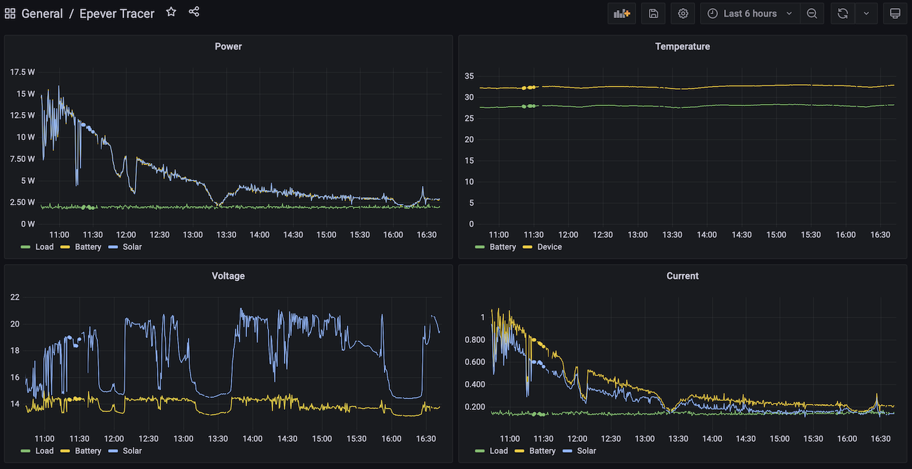

# modbusrtu_exporter

Prometheus exporter for Modbus protocol. Support direct RTU connections



## Configuration

Sample configuration can be found in the config.properties at ```./src/main/resources/config.properties```. The important option is ```server.collector```. This option defines how registers will be read from the device and interpreted. Currently supported collectors:

 * epeverTracer
 
If you can't find device in the list above, then please [raise issue](https://github.com/dernasherbrezon/modbusrtu_exporter/issues) and I will add it.

## Build

In order to build the project simply execute:

```
mvn clean package
```

## Run

Edit sample configuration at ```./src/main/resources/config.properties``` and run using the following command:

```
java -jar ./target/modbusrtu_exporter.jar ./src/main/resources/config.properties 
```

## Run as a service

1. Modify ```./src/main/resources/modbusrtu_exporter.service``` file
2. Copy this file:

```
sudo cp ./src/main/resources/modbusrtu_exporter.service /etc/systemd/system/
```

3. Enable the service:

```
sudo systemctl enable modbusrtu_exporter.service
```

4. Start the service:

```
sudo systemctl start modbusrtu_exporter.service
```

## Prometheus configuration

Currently only 1 device managed by each modbusrtu_exporter.

```
  - job_name: 'epeverTracer'
    static_configs:
      - targets: ['<ip address of modbusrtu_exporter>:9849']
```